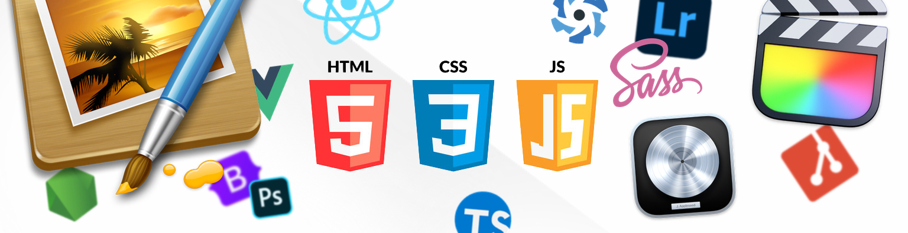

### Hello! 👋 

### My name is Oliver Green
Junior JS front end dev, and creative.
I come from music production with *Logic Pro X* and have some experience in video editing through *Final Cut Pro* and photography + editing with *Lightroom, Pixelmator and Photoshop*.

##### Here are some links to my work:
- Music on [Spotify](https://open.spotify.com/artist/2KZq8iWAr0lZ0L1Ua6HgQs)
- Music videos on [Youtube](https://www.youtube.com/c/COCOGREEN)
- Professional artist [Instagram](https://www.instagram.com/cocositoverde/?hl=es)
- Photography portfolio [Instagram](https://www.instagram.com/joyeuxcoco/?hl=es)
- My professional [portfolio](https://cococod3-a2405.web.app/)

######Skills & software:

My main used framework to today has been React, although I have some growing knowledge of Vue and Quasar.

HTML 5, CSS, JavaScript, TypeScript, React, Vue, Quasar, Sass, Bootstrap, Node.js, Jest.

- - -

Apart from my artistic career, I'm also a team leader. I have managed and opened 3 boutique hotels in Madrid, managing teams from 10 to 30 employees and leaded teams of surf instructors.

###### Some fun facts about me: :stuck_out_tongue_closed_eyes: 
I was born in Finland but have been raised in Málaga. My family on my father's side is English and mother's Finnish. I speak the three languages.
*My five year plan would be: me, able to work in web development, focus on studying AI and be part of a pasionate project. I'd love to manage my own team and escape every now and then to surf* :ocean:

###### You can reach me through :email:
- Email <a href = greenoliverj@gmail.com>greenoliverj@gmail.com</a>
- Linkedin [profile](https://www.linkedin.com/in/oliver-green-12b03784/) 

<!--
**Cococod3/Cococod3** is a ✨ _special_ ✨ repository because its `README.md` (this file) appears on your GitHub profile.

Here are some ideas to get you started:

- 🔭 I’m currently working on ...
- 🌱 I’m currently learning ...
- 👯 I’m looking to collaborate on ...
- 🤔 I’m looking for help with ...
- 💬 Ask me about ...
- 📫 How to reach me: ...
- 😄 Pronouns: ...
- ⚡ Fun fact: ...
-->
